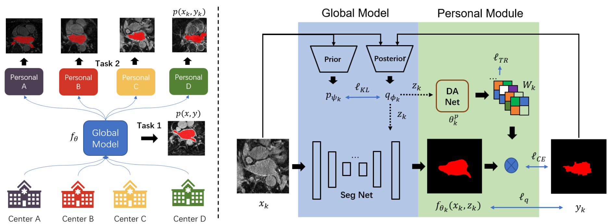

# Decoupling Predictions in Distributed Learning for Multi-Center Left Atrial MRI Segmentation
This project is developed for our MICCAI 2022 paper: [Decoupling Predictions in Distributed Learning
for Multi-Center Left Atrial MRI Segmentation](https://arxiv.org/submit/4349231). Our code is implemented based on the [[Learn_Noisy_Labels_Medical_Images](https://github.com/snu-mllab/PuzzleMix)](https://github.com/moucheng2017/Learn_Noisy_Labels_Medical_Images) and [[probabilistic_unet](https://github.com/snu-mllab/PuzzleMix)](https://github.com/SimonKohl/probabilistic_unet), but we used them to tackle the non-IID challenge in distributed leearning. For more information, please read the following paper:

<div align=center></div>

```
@article{Gao2022decouple,
  title={Decoupling Predictions in Distributed Learning for Multi-Center Left Atrial MRI Segmentation},
  author={Zheyao, Gao and Zhuang, Xiahai},
  journal={arXiv preprint arXiv:2203.01475},
  year={2022}
}
```

# Datasets
```
XXX_dataset/
  -- TestSet/
      --images/
      --labels/
  -- train/
      --images/
      --labels/
  -- val/
      --images/
      --labels/
```

# Usage
1. Set the "dataset" parameter in main.py, line 76, to the name of dataset, i.e., "MSCMR_dataset".
2. Set the "output_dir" in main.py, line 79, as the path to save the checkpoints. 
3. Download the dataset, for example, the [MSCMR_dataset](https://github.com/BWGZK/CycleMix/tree/main/MSCMR_dataset). Then, Set the dataset path in /data/mscmr.py, line 110, to your data path where the dataset is located in.
4. Check your GPU devices and modify the "GPU_ids" parameter in main.py, line 83 and "CUDA_VISIBLE_DEVICES" in run.sh.
5. Start to train by sh run.sh.
```
python main.py --mode feddan --lq 0.7 --weight 0.01 --size 256
```

# Requirements

This code has been tested with  
Python 3.8.5  
torch  1.7.0  
torchvision 0.8.0  
gco-wrapper (https://github.com/Borda/pyGCO)  


If you have any problems, please feel free to contact us. Thanks for your attention.
